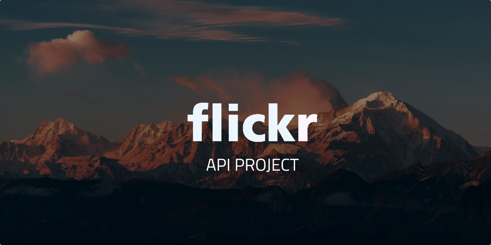

# Introduktion
Att förstå hur man på klientsidan jobbar mot API:er är en väsentlig kunskap för backendutvecklare, då det är i API:et mycket utav mötet mellan back- och frontend sker.

REST-api:er är det vanligaste protokollet för klienten att förses med extern data. Bemästrar man den tekniken, finns det ingen hejd på coola tjänster man kan bygga!

## Detta ska du göra
Du ska med hjälp av Flickrs API utveckla en klientapp med *html*, *css* och *vanilla JS* där du kan ```söka fram``` och ```snyggt visa``` bilder.


## Om Flickrs API

### API nyckel
För att få tillgång till flickers servrar behöver du en API-nyckel. Den är gratis, men kräver att du registrerat ett flickr-konto. Du skaffar en API-nyckel [här](https://www.flickr.com/services/api/misc.api_keys.html).

### Metoder och argument
Flickrs API är gigantiskt och innehåller många *resurser*. Vi kommer endast utforska och använda metoden ```flickr.photos.search``` i detta projekt.

Flickr API utgår ifrån denna basurl: 
```https://api.flickr.com/services/rest```

Således blir hela *basurl* ( sen tillkommer params ):

```
https://api.flickr.com/services/rest?method=flickr.photos.search
```

### Query Params

**Query params** kallas de förfrågningar man skickar med till servern. Dessa bestämmer **vad** och **hur** du får svar från servern. Varje förfrågan kallas för ett *argument* i sökningen. Argumenten skickas oftast med i [själva adressen](https://en.wikipedia.org/wiki/Query_string) och formateras enligt följande:

```
https://url.to.api?paramName=paramValue&paramName=paramValue...
```

Flickrs metod **flickr.photos.search** har [många valbara argument](https://www.flickr.com/services/api/flickr.photos.search.html), men endast ett är obligatoriskt och det är ```api_key```, d.v.s själva nyckeln för att få svar från servern. 

Det finns ingen standarisering vilka argument som finns vid en API-resurs utan detta är något man måste [läsa sig till i dokumentationen](https://www.flickr.com/services/api/flickr.photos.search.html).

Ett argument som *bör* vara med är ```format=json```då Flickrs API stödjer ett gäng fler andra format. Detta gör att du får tillbaka JSON som en callback. Detta blir lite meckigt att jobba med, så lägg även på argumentet ```&nojsoncallback=1```. 


En adress kan innehålla en eller flera argument och kan bli väldigt lång!

En hel förfrågan kan se ut såhär:

```
https://api.flickr.com/services/rest?method=flickr.photos.search&api_key=abc12378asdashdjsah8sds&text=banana&per_page=20&sort=date-taken-asc&format=json&nojsoncallback=1
```

### Flickrs bild URL:er
JSON kan inte innehålla bilder, så den datan du får tillbaka använder några olika parametrar för att *bygga ihop* en url till bilden. Detta beskrivs väldigt tydligt [i dokumentationen](https://www.flickr.com/services/api/misc.urls.html).

Bildadresser byggs ihop enligt följande:

```
https://farm{farm-id}.staticflickr.com/{server-id}/{id}_{secret}_[mstzb].jpg
```

```farm-id```, ```server-id```, ```id``` och ```secret```, är alla params du får tillbaka från servern. Det du bestämmer själv är storlek ( ```size``` ) på bilden samt ev. annat bildformat ( default är jpg vilket är bäst i 99% av fallen).

En hel bildadress ser ut så här:

```
https://farm1.staticflickr.com/2/1418878_1e92283336_m.jpg
```

## Bedömning
### Godkänt
En webbapp byggt på Flickrs API där du:
- användt HTML, CSS ( inkl flexbox ) och vanilla JS
- kan söka efter bilder med hjälp av textsök
- visa sökresultatet ett snyggt sätt i galleri-form
- kan presentera klickad bild i större storlek ( ex. [lightbox effekt](https://en.wikipedia.org/wiki/Lightbox_(JavaScript)) )

### Väl godkänt
För VG ska du nå samtliga G-krav samt:
- mer funktiolitet utifrån metodens [argument](https://www.flickr.com/services/api/flickr.photos.search.html), ex. *licenstyp*, *antal bilder du får tillbaka*, *tags* eller dyl. 
- pagnation-funktionalitet där du kan bläddra mellan olika sidor av sökresultaten
- felhantering där felkoden meddelas användaren